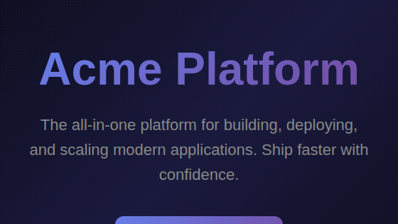

# DemoScript

Generate polished demo videos from any URL. Define scroll, zoom, highlight, and pan actions on page elements — renders MP4/GIF automatically via headless Chromium + FFmpeg.

No screen recording. No manual clicking. Pure config-to-video.

<p align="center">
  
</p>

## Install

```bash
npm install demoscript
npx playwright install chromium
```

## Quick Start

### 1. Capture page elements

```bash
npx demoscript capture https://your-site.com
```

```
Found 12 elements:

  Selector                 | Tag        | Text
  ----------------------------------------------------------
  #hero                    | section    | Welcome to Acme...
  #features                | section    | Powerful Features...
  #pricing                 | section    | Simple Pricing...
  h1                       | h1         | Acme Platform
  .pricing-card.featured   | div        | Pro — $29/mo
  #cta                     | button     | Get Started Free
```

### 2. Write a script

Create `demo.json`:

```json
{
  "url": "https://your-site.com",
  "steps": [
    { "action": "wait", "duration": 1, "annotation": "Welcome to Acme" },
    { "action": "highlight", "target": "h1", "duration": 1.5, "highlightColor": "#6366F1" },
    { "action": "zoom-in", "target": "h1", "duration": 1.5, "zoom": 2.0 },
    { "action": "zoom-out", "duration": 1 },
    { "action": "scroll-to", "target": "#pricing", "duration": 2, "easing": "ease-in-out" },
    { "action": "highlight", "target": ".pricing-card.featured", "duration": 2, "highlightColor": "#f59e0b" }
  ]
}
```

### 3. Render

```bash
npx demoscript render --script demo.json
npx demoscript render --script demo.json --format gif --fps 12
npx demoscript render --script demo.json -o ./videos --width 1920 --height 1080
```

---

## Features

### Watch Mode — Auto-render on save

Watch a script file and re-render automatically whenever you save changes:

```bash
npx demoscript watch --script demo.json
```

Changes are debounced (500ms) to avoid double-renders from editor write patterns. The latest output video opens automatically when rendering completes. Use `--no-open` to disable.

```bash
npx demoscript watch --script demo.json --no-open --format gif
```

### Multi-Format Export

Render all formats in a single pass simultaneously:

```bash
npx demoscript render --script demo.json --all-formats
```

Or pick specific formats:

```bash
npx demoscript render --script demo.json --formats mp4-standard,mp4-twitter,thumbnail
```

| Format ID | Output | Description |
|-----------|--------|-------------|
| `mp4-standard` | `.mp4` | Full-resolution H.264 for web |
| `mp4-twitter` | `.mp4` | Twitter/X optimized (max 60s) |
| `mp4-linkedin` | `.mp4` | Square 1:1 crop, 1080×1080 for LinkedIn |
| `gif` | `.gif` | Palette-optimized GIF, 600px wide at 15fps |
| `thumbnail` | `.png` | First frame at full resolution |

Output files are named `demo_<id>_<format>.ext` and written to the output directory.

### AI Script Generation

Generate a demo script from a URL and a plain-English description:

```bash
export ANTHROPIC_API_KEY=sk-ant-...

npx demoscript generate \
  --url https://your-site.com \
  --prompt "Show the hero section, scroll to pricing, highlight the Pro plan" \
  --output demo.json
```

The generator captures page elements automatically, sends them to Claude, and writes a valid `demo.json`. Review it, tweak as needed, then render:

```bash
npx demoscript render --script demo.json
```

**Programmatic API:**

```typescript
import { generate } from 'demoscript'

const result = await generate({
  url: 'https://your-site.com',
  prompt: 'Highlight the main features and show the pricing table',
  apiKey: process.env.ANTHROPIC_API_KEY,
})

console.log(result.steps)          // Generated Step[]
console.log(result.tokensUsed)     // Token count
console.log(result.estimatedDuration) // Total seconds
```

### Hosted Cloud Rendering

Render in the cloud without a local Chromium/FFmpeg installation:

```bash
npx demoscript auth set-key ds_live_<your-key>
npx demoscript render --script demo.json --api-key ds_live_<your-key>
```

Check your usage:

```bash
npx demoscript cloud status
```

**Programmatic API:**

```typescript
import { createCloudClient } from 'demoscript'

const client = createCloudClient({ apiKey: process.env.DEMOSCRIPT_API_KEY! })

// Check account
const auth = await client.checkAuth()
console.log(`${auth.rendersRemaining} renders remaining this month`)

// Render
const result = await client.render(script, 'mp4-standard', {
  onProgress: (pct, msg) => console.log(`${pct}% ${msg}`),
})

// Download
await client.downloadToFile(result.downloadUrls['mp4-standard'], './output/demo.mp4')
```

### GitHub Action

Automatically render demo videos on every push or release:

```yaml
# .github/workflows/demo.yml
name: Render Demo Video

on:
  push:
    paths: ['demo.json']

jobs:
  render:
    runs-on: ubuntu-latest
    steps:
      - uses: actions/checkout@v4
      - uses: rudraptpsingh/DemoScript@v1
        with:
          script-path: demo.json
          output-path: docs/demo.mp4
          format: mp4-standard
          commit-output: true
          commit-message: "chore: update demo video [skip ci]"
```

**Inputs:**

| Input | Required | Default | Description |
|-------|----------|---------|-------------|
| `script-path` | Yes | — | Path to the JSON script file |
| `output-path` | No | `output/demo.mp4` | Where to write the output file |
| `format` | No | `mp4-standard` | Format ID (see table above) |
| `api-key` | No | — | DemoScript cloud API key (uses local render if omitted) |
| `commit-output` | No | `false` | Commit the rendered file back to the repo |
| `commit-message` | No | `chore: update demo video` | Commit message |

**Outputs:** `output-file`, `render-duration-seconds`

See [`github-action/examples/`](github-action/examples/) for more workflow examples including release-triggered renders and README badge updates.

---

## Programmatic API

```typescript
import { render, capture, generate, createCloudClient } from 'demoscript'

// Capture page elements
const page = await capture('https://your-site.com')
console.log(page.elements) // [{ selector: '#hero', label: 'hero', ... }, ...]

// Render a video
const result = await render({
  url: 'https://your-site.com',
  steps: [
    { action: 'wait', duration: 1 },
    { action: 'scroll-to', target: '#pricing', duration: 2 },
    { action: 'highlight', target: '.plan-pro', duration: 1.5, highlightColor: '#6366F1' },
  ],
  fps: 24,
  outputFormat: 'mp4',
  viewport: { width: 1280, height: 720 },
  outputDir: './output',
  onProgress: (pct, msg) => console.log(`${pct}% ${msg}`),
})

console.log(result.outputPath) // /path/to/output/demo_xxxxx.mp4
console.log(result.frameCount) // 96
console.log(result.duration)   // 4
```

---

## Available Actions

| Action | Description | Key Options |
|--------|-------------|-------------|
| `wait` | Hold current frame | `duration`, `annotation` |
| `scroll-to` | Smooth scroll to element | `target`, `duration`, `easing` |
| `zoom-in` | Zoom into element | `target`, `duration`, `zoom` (1.5–3.5) |
| `zoom-out` | Zoom back to normal | `duration` |
| `highlight` | Colored border around element | `target`, `duration`, `highlightColor` |
| `pan` | Pan viewport to element | `target`, `duration`, `easing` |
| `cursor-move` | Animate cursor to element | `target`, `duration` |
| `click` | Move cursor and click element | `target`, `duration` |

## Step Options

```typescript
{
  action: 'scroll-to',              // Required: action type
  target: '#pricing',               // CSS selector (null for whole-page actions)
  duration: 2,                      // Seconds (0.5–5.0)
  easing: 'ease-in-out',            // 'linear' | 'ease-in' | 'ease-out' | 'ease-in-out'
  annotation: 'Check our pricing',  // Text overlay shown at the bottom
  highlightColor: '#6366F1',        // Border color for highlight (hex)
  zoom: 2.0,                        // Magnification level for zoom-in/zoom-out
}
```

---

## Web UI

DemoScript includes a full web editor with a visual timeline:

```bash
git clone https://github.com/rudraptpsingh/DemoScript.git
cd DemoScript
npm install
npx playwright install chromium
npm run dev
# Open http://localhost:3000
```

1. Paste a URL and click **Capture**
2. Click elements in the page preview to add steps
3. Configure actions, durations, and easing in the timeline sidebar
4. Switch to **AI Mode** to generate a script from a plain-English prompt
5. Click **Render MP4** and download your video

---

## Testing

```bash
# Unit + integration tests (fast, no browser)
npm test

# End-to-end tests (real Chromium + FFmpeg renders)
npm run test:e2e

# Everything
npm run test:all
```

| Test file | What it covers |
|-----------|---------------|
| `tests/ai-generator.test.ts` | `buildSystemPrompt`, `parseAIResponse`, `validateGeneratedSteps`, prompt construction |
| `tests/watch-mode.test.ts` | Debounce, JSON parse errors, `stop()`, `AbortError` |
| `tests/multi-format.test.ts` | `FORMAT_SPECS`, `encodeMultipleFormats`, format spec fields |
| `tests/cloud-client.test.ts` | Error classes, auth/rate-limit mocks, `render()`, `downloadToFile()` |
| `tests/github-action.test.ts` | `action.yml` structure, `main.ts` logic, example workflows |
| `tests/unit-coverage.test.ts` | Cross-cutting unit tests for all phases |
| `tests/edge-cases.test.ts` | Debounce timing, thumbnail failure, retry logic, boundary values |
| `tests/e2e.test.ts` | Real renders (MP4, GIF, PNG) against `public/test-site.html` |

---

## Requirements

- Node.js >= 18
- Chromium — `npx playwright install chromium`
- FFmpeg — bundled via `@ffmpeg-installer/ffmpeg` (no system install needed)

## License

MIT
