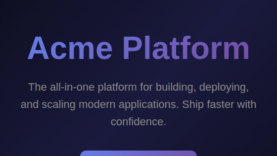

# DemoScript

Generate polished demo videos from any URL. Define scroll, zoom, highlight, and pan actions on page elements — renders MP4/GIF automatically via headless Chromium + FFmpeg.

No screen recording. No manual clicking. Pure config-to-video.

<p align="center">
  
</p>

## Install

```bash
npm install demoscript
npx playwright install chromium
```

## Quick Start

### 1. Capture page elements

```bash
npx demoscript capture https://your-site.com
```

```
Found 12 elements:

  Selector                 | Tag        | Text
  ----------------------------------------------------------
  #hero                    | section    | Welcome to Acme...
  #features                | section    | Powerful Features...
  #pricing                 | section    | Simple Pricing...
  h1                       | h1         | Acme Platform
  .pricing-card.featured   | div        | Pro — $29/mo
  #cta                     | button     | Get Started Free
```

### 2. Write a script

Create `demo.json`:

```json
{
  "url": "https://your-site.com",
  "steps": [
    { "action": "wait", "duration": 1, "annotation": "Welcome to Acme" },
    { "action": "highlight", "target": "h1", "duration": 1.5, "highlightColor": "#6366F1" },
    { "action": "zoom-in", "target": "h1", "duration": 1.5, "zoom": 2.0 },
    { "action": "zoom-out", "duration": 1 },
    { "action": "scroll-to", "target": "#pricing", "duration": 2, "easing": "ease-in-out" },
    { "action": "highlight", "target": ".pricing-card.featured", "duration": 2, "highlightColor": "#f59e0b" }
  ]
}
```

### 3. Render

```bash
npx demoscript render --script demo.json
npx demoscript render --script demo.json --format gif --fps 12
npx demoscript render --script demo.json -o ./videos --width 1920 --height 1080
```

---

## Features

### Watch Mode — Auto-render on save

Watch a script file and re-render automatically whenever you save changes:

```bash
npx demoscript watch --script demo.json
```

Changes are debounced (500ms) to avoid double-renders from editor write patterns. The latest output video opens automatically when rendering completes. Use `--no-open` to disable.

```bash
npx demoscript watch --script demo.json --no-open --format gif
```

### Multi-Format Export

Render all formats in a single pass simultaneously:

```bash
npx demoscript render --script demo.json --all-formats
```

Or pick specific formats:

```bash
npx demoscript render --script demo.json --formats mp4-standard,mp4-twitter,thumbnail
```

| Format ID | Output | Description |
|-----------|--------|-------------|
| `mp4-standard` | `.mp4` | Full-resolution H.264 for web |
| `mp4-twitter` | `.mp4` | Twitter/X optimized (max 60s) |
| `mp4-linkedin` | `.mp4` | Square 1:1 crop, 1080×1080 for LinkedIn |
| `gif` | `.gif` | Palette-optimized GIF, 600px wide at 15fps |
| `thumbnail` | `.png` | First frame at full resolution |

Output files are named `demo_<id>_<format>.ext` and written to the output directory.

### AI Script Generation

Generate a demo script from a URL and a plain-English description:

```bash
export ANTHROPIC_API_KEY=sk-ant-...

npx demoscript generate \
  --url https://your-site.com \
  --prompt "Show the hero section, scroll to pricing, highlight the Pro plan" \
  --output demo.json
```

The generator captures page elements automatically, sends them to Claude, and writes a valid `demo.json`. Review it, tweak as needed, then render:

```bash
npx demoscript render --script demo.json
```

**Programmatic API:**

```typescript
import { generate } from 'demoscript'

const result = await generate({
  url: 'https://your-site.com',
  prompt: 'Highlight the main features and show the pricing table',
  apiKey: process.env.ANTHROPIC_API_KEY,
})

console.log(result.steps)          // Generated Step[]
console.log(result.tokensUsed)     // Token count
console.log(result.estimatedDuration) // Total seconds
```

### Hosted Cloud Rendering

Render in the cloud without a local Chromium/FFmpeg installation:

```bash
npx demoscript auth set-key ds_live_<your-key>
npx demoscript render --script demo.json --api-key ds_live_<your-key>
```

Check your usage:

```bash
npx demoscript cloud status
```

**Programmatic API:**

```typescript
import { createCloudClient } from 'demoscript'

const client = createCloudClient({ apiKey: process.env.DEMOSCRIPT_API_KEY! })

// Check account
const auth = await client.checkAuth()
console.log(`${auth.rendersRemaining} renders remaining this month`)

// Render
const result = await client.render(script, 'mp4-standard', {
  onProgress: (pct, msg) => console.log(`${pct}% ${msg}`),
})

// Download
await client.downloadToFile(result.downloadUrls['mp4-standard'], './output/demo.mp4')
```

### GitHub Action

Automatically render demo videos on every push or release:

```yaml
# .github/workflows/demo.yml
name: Render Demo Video

on:
  push:
    paths: ['demo.json']

jobs:
  render:
    runs-on: ubuntu-latest
    steps:
      - uses: actions/checkout@v4
      - uses: rudraptpsingh/DemoScript@v1
        with:
          script-path: demo.json
          output-path: docs/demo.mp4
          format: mp4-standard
          commit-output: true
          commit-message: "chore: update demo video [skip ci]"
```

**Inputs:**

| Input | Required | Default | Description |
|-------|----------|---------|-------------|
| `script-path` | Yes | — | Path to the JSON script file |
| `output-path` | No | `output/demo.mp4` | Where to write the output file |
| `format` | No | `mp4-standard` | Format ID (see table above) |
| `api-key` | No | — | DemoScript cloud API key (uses local render if omitted) |
| `commit-output` | No | `false` | Commit the rendered file back to the repo |
| `commit-message` | No | `chore: update demo video` | Commit message |

**Outputs:** `output-file`, `render-duration-seconds`

See [`github-action/examples/`](github-action/examples/) for more workflow examples including release-triggered renders and README badge updates.

---

## Programmatic API

```typescript
import { render, capture, generate, createCloudClient } from 'demoscript'

// Capture page elements
const page = await capture('https://your-site.com')
console.log(page.elements) // [{ selector: '#hero', label: 'hero', ... }, ...]

// Render a video
const result = await render({
  url: 'https://your-site.com',
  steps: [
    { action: 'wait', duration: 1 },
    { action: 'scroll-to', target: '#pricing', duration: 2 },
    { action: 'highlight', target: '.plan-pro', duration: 1.5, highlightColor: '#6366F1' },
  ],
  fps: 24,
  outputFormat: 'mp4',
  viewport: { width: 1280, height: 720 },
  outputDir: './output',
  onProgress: (pct, msg) => console.log(`${pct}% ${msg}`),
})

console.log(result.outputPath) // /path/to/output/demo_xxxxx.mp4
console.log(result.frameCount) // 96
console.log(result.duration)   // 4
```

---

## Available Actions

| Action | Description | Key Options |
|--------|-------------|-------------|
| `wait` | Hold current frame | `duration`, `annotation` |
| `scroll-to` | Smooth scroll to element | `target`, `duration`, `easing` |
| `zoom-in` | Zoom into element | `target`, `duration`, `zoom` (omit to auto-fit the element) |
| `zoom-out` | Zoom back to normal | `duration` |
| `highlight` | Colored border around element | `target`, `duration`, `highlightColor` |
| `pan` | Pan viewport to element | `target`, `duration`, `easing` |
| `cursor-move` | Animate cursor to element | `target`, `duration` |
| `title` | Full-frame story card | `annotation` (heading), `subtitle`, `duration` |
| `click` | Move cursor and click element | `target`, `duration` |

## Step Options

```typescript
{
  action: 'scroll-to',              // Required: action type
  target: '#pricing',               // CSS selector (null for whole-page actions)
  duration: 2,                      // Seconds (0.5–5.0)
  easing: 'smooth',                 // optional; see the easing table below
  annotation: 'Check our pricing',  // On-screen text; the heading on a title card
  annotationPosition: 'bottom',     // 'bottom' | 'top' | 'center' | 'callout'
  subtitle: 'Billed yearly',        // Quieter second line
  highlightColor: '#6366F1',        // Border color for highlight (hex)
  zoom: 2.0,                        // Omit on zoom-in to frame the element automatically
}
```

### Easing

Camera motion is what makes a render feel hand-made rather than scripted. Zooms
default to `smooth`, which starts and ends with zero speed and zero
acceleration, so the camera neither lurches off the mark nor stops dead. Scale
is also interpolated in log space, which is how zoom is perceived: a linear
1x→4x ramp feels fast at the start and sluggish at the end even with a gentle
curve.

| Easing | Feel | Use for |
|--------|------|---------|
| `linear` | Constant speed | Mechanical motion, progress bars |
| `ease-in` | Slow start, fast finish | Leaving a resting state |
| `ease-out` | Fast start, soft landing | Most moves |
| `ease-in-out` | Soft at both ends | Long scrolls |
| `smooth` | Starts and ends at rest | **Default for zooms.** Camera moves |
| `ease-out-expo` | Fast off the mark, long settle | Snappy UI emphasis — avoid for zooms, it lurches |
| `ease-in-out-quart` | Very soft both ends | Slow, deliberate reveals |
| `spring` | Slight overshoot, then settles | Short moves under ~0.6s |

`spring` reads as lively on a short step and seasick on a long one — keep it brief.

### Zooming to a component

Leave `zoom` out of a `zoom-in` step and DemoScript measures the element and
picks a magnification that frames it with a small margin, capped at 4x. That is
usually what you want when zooming to a real UI component: a fixed `2.0` is too
tight on a wide panel and too loose on a small control.

```json
{ "action": "zoom-in", "target": ".pricing-card.featured", "duration": 1.2 }
```

The camera moves the target to the **centre** of the frame as it zooms, and
stops short of showing past the page edge. Zooming "in place" instead keeps an
element wherever it already sits on screen, so a toolbar or side panel stays
pinned to its edge and half of it is pushed out of frame.

Zooms also start from wherever the camera already is. Two `zoom-in` steps in a
row glide straight from the first component to the second; you only need
`zoom-out` when you want to return to the full frame.

```json
{ "action": "zoom-in", "target": "#hero h1", "duration": 1.2 },
{ "action": "zoom-in", "target": "#cta", "duration": 1.2 },
{ "action": "zoom-out", "duration": 1.0 }
```

### Text on screen

Any step can carry a caption; `title` gives you a full-frame story card for the
open and the close.

```json
{ "action": "title", "duration": 2.2, "annotation": "Cull a wedding in one sitting", "subtitle": "Straight off the card" },
{ "action": "highlight", "target": ".card.selected", "duration": 1.4, "annotation": "Green: selected", "annotationPosition": "callout" },
{ "action": "zoom-in", "target": ".card.selected", "duration": 1.6, "annotation": "Select, reject and star as you go", "subtitle": "Tags happen in the same pass" }
```

`callout` anchors the caption to the step's `target` — under it, or above when
there is no room — instead of parking everything at the bottom of the frame.

Type is sized as a **share of frame height**, not in fixed pixels: a caption is
~3.4% of the height (about 29px on an 844px-tall recording), a title-card
heading ~7.5%, both clamped at each end. The same script stays readable whether
it renders at 720p for a blog embed or tall for a phone-shaped reel, which a
fixed 16px caption does not. Text sits inside a 5.5% safe margin, wraps at
about two-thirds of the frame width to keep lines in the 40–60 character range,
sits on a scrim rather than relying on a shadow (these overlays land on
photographs), and fades in and out rather than popping.

---

## Recording an app, not a page

`--connect` attaches to a browser that is **already running** over the Chrome
DevTools Protocol instead of launching a fresh headless one. This is how you
record something that is not a plain URL: an Electron app, a desktop build, or
a page that took a long sign-in to reach.

Start your app with remote debugging enabled:

```bash
# Electron
electron . --remote-debugging-port=9222
```

```bash
# Chrome / Chromium
chrome --remote-debugging-port=9222
```

Then point a render at it:

```bash
npx demoscript render --script demo.json --connect http://127.0.0.1:9222
```

In attach mode DemoScript treats the browser as borrowed: it does **not**
navigate, resize, strip cookie banners, pause animations, or close the app when
the render finishes. `url` and `viewport` in your script are ignored — frames
are sized from the live window. Everything else (zoom, highlight, pan,
annotations) works exactly as it does on a page.

This also composes with a test harness: drive the app to the state you want
with Playwright or your own script, leave it open, and let DemoScript do the
camera work.

---

## Web UI

DemoScript includes a full web editor with a visual timeline:

```bash
git clone https://github.com/rudraptpsingh/DemoScript.git
cd DemoScript
npm install
npx playwright install chromium
npm run dev
# Open http://localhost:3000
```

1. Paste a URL and click **Capture**
2. Click elements in the page preview to add steps
3. Configure actions, durations, and easing in the timeline sidebar
4. Switch to **AI Mode** to generate a script from a plain-English prompt
5. Click **Render MP4** and download your video

---

## Testing

```bash
# Unit + integration tests (fast, no browser)
npm test

# End-to-end tests (real Chromium + FFmpeg renders)
npm run test:e2e

# Everything
npm run test:all
```

| Test file | What it covers |
|-----------|---------------|
| `tests/ai-generator.test.ts` | `buildSystemPrompt`, `parseAIResponse`, `validateGeneratedSteps`, prompt construction |
| `tests/watch-mode.test.ts` | Debounce, JSON parse errors, `stop()`, `AbortError` |
| `tests/multi-format.test.ts` | `FORMAT_SPECS`, `encodeMultipleFormats`, format spec fields |
| `tests/cloud-client.test.ts` | Error classes, auth/rate-limit mocks, `render()`, `downloadToFile()` |
| `tests/github-action.test.ts` | `action.yml` structure, `main.ts` logic, example workflows |
| `tests/unit-coverage.test.ts` | Cross-cutting unit tests for all phases |
| `tests/edge-cases.test.ts` | Debounce timing, thumbnail failure, retry logic, boundary values |
| `tests/e2e.test.ts` | Real renders (MP4, GIF, PNG) against `public/test-site.html` |

---

## Requirements

- Node.js >= 18
- Chromium — `npx playwright install chromium`
- FFmpeg — bundled via `@ffmpeg-installer/ffmpeg` (no system install needed)

## License

MIT
